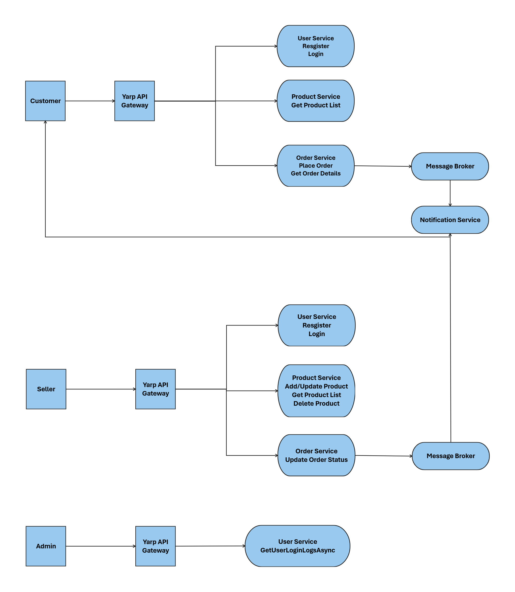

# E-Commerce Product Catalog & Order Tracking System

## Microservices Overview

### 1. User Service
- Customers can register and log in.
- Sellers can log in to manage products.
- Admins can oversee system activity.
- JWT-based authentication ensures security.

### 2. Product Service
- Sellers can add, update, or delete products.
- Customers can view the products available.
- Prevents customers from ordering out-of-stock products.

### 3. Order Service
- Customers can place orders, and sellers get notified.
- Tracks order status updates (Processing → Shipped).
- Ensures stock is deducted only when an order is placed.

### 4. Notification Service
- Sends email/SMS notifications when:
  - A new order is placed.
  - Order status changes (Processing → Shipped).
- Uses RabbitMQ for async messaging.

## Technical Considerations
- **YARP (API Gateway)**: Routes requests to microservices.
- **JWT Authentication**: Ensures users access only their relevant data.
- **RabbitMQ for Notifications**: Async notifications for order updates.
- **Database Per Service**: Products, orders, and users stored separately.

## System Flow Diagram

*(Note: Add the actual flow diagram image in the project directory and update the filename accordingly.)*
